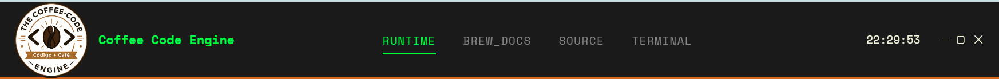
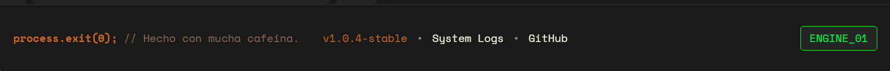
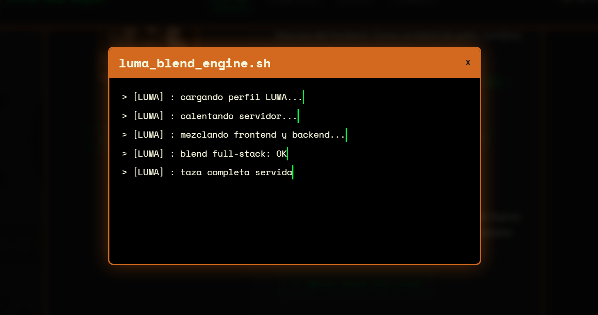
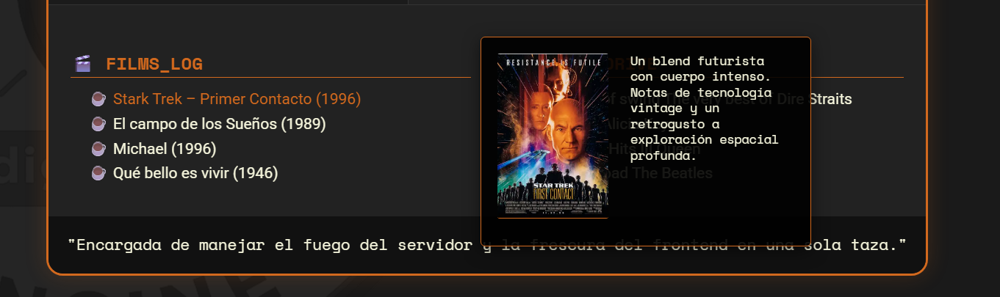
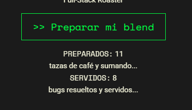

# Funciones dinámicas utilizadas en las páginas



## actualizarReloj()
Objetivo capturar el tiempo actual del sistema y renderizarlo en la interfaz del usuario.
- **USO**: en navbar.html

```const contenedorHora = document.getElementById('current-time');``` 

Busca en el archivo HTML un elemento que tenga el atributo id="current-time".  Es donde se mostrará la hora.


```if(!contenedorHora) return;``` 

Si el elemento no existe en la página actual, la función se detiene inmediatamente para evitar errores en la consola.

```const ahora = new Date();```

Crea una nueva instancia del objeto Date, que contiene la fecha y hora exacta del sistema en el instante preciso en que se ejecuta la línea.

```const horas = String(ahora.getHours()).padStart(2, '0');```

- ```getHours()```: Extrae la hora (0-23).
- ```String()```: Convierte ese número en texto para poder manipularlo.
- ```padStart(2, '0')```: Es una función de formato. Asegura que el texto tenga siempre al menos 2 caracteres. Si la hora es "9", le agrega un "0" a la izquierda para que se vea como "09".

```const minutos = String(ahora.getMinutes()).padStart(2, '0');``` 

Hace exactamente lo mismo que la línea anterior, pero capturando los minutos (0-59) del objeto ahora.
```const segundos = String(ahora.getSeconds()).padStart(2, '0');``` 

Captura los segundos (0-59) y les aplica el mismo formato de dos dígitos.

```contenedorHora.textContent = \${horas}:${minutos}:${segundos}`;```

Utiliza un Template Literal (las comillas invertidas) para armar la cadena final con el formato HH:MM:SS y la inyecta dentro del elemento HTML que llamamos al principio.
 
## loadNavbar: 
Objetivo cargar de forma dinámica el menú de navegación, evitando tener que copiar y pegar el código de esta función en cada página HTML.

- **USO**: en todas las PÁGINAS.

```async function() {```

Define una función asíncrona (async). Esto es fundamental porque la carga de un archivo externo toma tiempo, y el uso de async permite que el navegador siga haciendo otras cosas mientras espera la respuesta del servidor sin bloquear la interfaz.

```const response = await fetch("./navbar.html");```
```fetch("./navbar.html")```

Envía una solicitud HTTP al servidor para obtener el archivo llamado navbar.html que está en la misma carpeta.

```await```

Detiene la ejecución de esta función específica hasta que el servidor responda (ya sea con éxito o con un error).

```const text = await response.text();``` 

Una vez que recibimos la respuesta, necesitamos extraer su contenido. El método ```.text()``` convierte el cuerpo de esa respuesta en una cadena de texto plana (el código HTML puro). También usa await porque esta conversión es una operación asíncrona.

```document.getElementById("navbar-container").innerHTML = text;```

- ```document.getElementById("navbar-container"):``` Busca en la página HTML un elemento  que tenga el ID navbar-container.
- ```.innerHTML = text``` Toma todo el código HTML que extrajimos del archivo navbar.html y lo "inyecta" dentro de ese contenedor. 

## loadFooter:
Ídem loadNavBar.



- **USO**: en todas las PÁGINAS

 
## printLog:
Objetivo simular una consola que escribe paso a paso.



- **USO**: en todas las FICHAS DE BARISTAS.

```async function(message, targetElement, delay = 1000) {```

Define una función asíncrona que recibe tres parámetros: el texto a mostrar (message), el contenedor HTML donde aparecerá (targetElement) y un tiempo de espera opcional (delay) que por defecto es de 1000 milisegundos (1 segundo).

```if (!targetElement) { ... }```

Si la función llama a un elemento no válido donde escribir, muestra un error en la consola para el desarrollador y detiene la ejecución con el return.

```const p = document.createElement('p');```

Crea un nuevo elemento de párrafo (```<p>```) en la memoria del navegador, pero todavía no lo añade a la página.

```p.textContent = `\> ${message}`;```

Asigna el texto al párrafo recién creado, agregándole un símbolo > al principio para que parezca una línea de comandos o terminal.

```targetElement.appendChild(p);```

Toma ese párrafo y lo inserta físicamente dentro del elemento de destino. En este momento, el mensaje se vuelve visible en la pantalla.

```targetElement.scrollTop = targetElement.scrollHeight;```

Esta línea es para mejorar la experiencia de usuario (UX). Si el contenedor tiene muchos mensajes y aparece una barra de desplazamiento, esta instrucción hace que baje automáticamente hasta el fondo para que el usuario siempre vea el último mensaje que se imprimió.

```return new Promise(resolve => setTimeout(resolve, delay));```

Esta es la "pausa". Retorna una Promesa que se resuelve sólo cuando pasa el tiempo indicado en delay. 


 
## fetchMediaData:
Función cuyo objetivo es poder consumir datos de un archivo JSON, se incorporó también manejo de errores.

- **USO**: en todas las FICHAS DE BARISTAS.

## toggleTooltip:
Función que gestiona la aparición y desaparición de un cuadro informativo (tooltip) que sigue al cursor.

- **USO**: en todas las FICHAS DE BARISTAS.

```function(isVisible, data = null, e = null) {```

Define la función con tres parámetros: un booleano (```isVisible```) para saber si mostrarlo u ocultarlo, los datos del contenido (```data```) y el evento del ratón (```e```). Los últimos dos tienen un valor por defecto null por si solo se quiere ocultar el tooltip.

```const tooltip = document.getElementById('barista-tooltip');```
Busca en el HTML el elemento que sirve de caja para el tooltip.

```if (!tooltip) return;```

Para evitar errores si el elemento no existe en el DOM.

```if (isVisible && data && e) {```

Verifica que se cumplan las tres condiciones: que queramos mostrarlo (```true```), que tengamos información para mostrar y que exista un evento de ratón para saber dónde posicionarlo.

```tooltip.innerHTML = \ ... `;```

Inyecta dinámicamente el contenido. Crea una imagen (``````) usando la ruta de data.image y un párrafo (```<p>```) con el texto de data.text.

```tooltip.style.display = 'flex';```

Cambia el estilo CSS para que el cuadro sea visible.

```const offsetX = 20; y const offsetY = -200;```

Define variables de "desplazamiento" (```offset```). Esto sirve para que el tooltip no aparezca justo debajo del puntero (tapándolo), sino un poco hacia el costado y hacia arriba.

```tooltip.style.left = \${e.pageX + offsetX}px`;```

Calcula la posición horizontal. Toma la coordenada **X** del ratón (```e.pageX```) y le suma el desplazamiento.

```tooltip.style.top = \${e.pageY + offsetY}px`;```

Calcula la posición vertical. Toma la coordenada **Y** del ratón (```e.pageY```) y le resta los píxeles del offset para que flote sobre el cursor.

```} else {```
Si alguna de las condiciones del primer if no se cumple (por ejemplo, si el ratón salió del elemento y ```isVisible``` es ```false```).

```tooltip.style.display = 'none';```

Oculta el cuadro completamente de la vista.

```tooltip.innerHTML = '';```

Limpia el contenido interno. 

## document.addEventListener('DOMContentLoaded', init);
Esta línea es el "interruptor" que pone todo en marcha. Objetivo asegurar que el código JavaScript no intente manipular elementos que el navegador aún no ha terminado de dibujar.

- **USO**: en todas las FICHAS DE BARISTAS.

- ```document```: Hace referencia a todo el modelo de objetos del documento (DOM), es decir, la estructura completa de la página HTML.
- ```.addEventListener(...)```: Es un método que le dice al navegador que se quede escuchando y esperando a que suceda algo específico.
- ```'DOMContentLoaded'```: Es el nombre del evento que estamos esperando. Este evento se dispara exactamente cuando el navegador ha terminado de cargar y procesar todo el código HTML de la página.
-```init```: Es el nombre de la función que se ejecutará apenas el evento se dispare. En nuestro código, es la función principal que contiene las llamadas a loadNavbar, actualizarRelog y otras configuraciones iniciales.

 


## btnPreparar y btnServir:
Botones que al escuchar un evento click tienen como objetivo mostrar un modal que activa una consola que simula la analogía de preparación y servido de una taza de café. También posee un contador que contabiliza las tazas preparadas y servidas. Y se guarda el valor actualizado en la memoria del navegador (```localStorage```).

- **USO**: en todas las FICHAS DE BARISTAS.


<video controls src="grabacion.mp4" title="mouseOver y mouseOut"></video>

## Evento Mouseover y Mouseout
```document.addEventListener('mouseover/mouseout', (e) => {```

Le dice al navegador que escuche cada vez que el puntero del ratón se mueva sobre cualquier elemento del documento. El parámetro (```e```) es el objeto del evento que contiene toda la información de lo que el usuario está tocando.

- **USO**: en todas las FICHAS DE BARISTAS.

```const id = e.target.dataset.id;```

- ```e.target```: Es el elemento exacto sobre el cual está el ratón en este momento.
- ```.dataset.id```: Accede a los atributos personalizados de HTML que empiezan con ```data-``` (en este caso, buscaría un data-id="valor").

```if(id && notasDeCata[id]) {```
Verifica dos cosas: que el elemento tenga un id y que ese ID exista dentro de nuestro objeto de datos ```notasDeCata```. Es para asegurar de no intentar mostrar un tooltip para elementos que no lo necesitan.

```utils.toggleTooltip(true, notasDeCata[id], e);```

Si las condiciones se cumplen, llama a la función ```toggleTooltip``` pasando ```true``` para mostrar los datos específicos de esa notadecata y el evento e (para obtener las coordenadas del mouse).

```utils.toggleTooltip(false);```

Si salimos de un elemento interactivo, llama a ```toggleTooltip``` con ```false```. Esto dispara la lógica que oculta el modal y limpia el contenido, dejando la interfaz limpia de nuevo.


